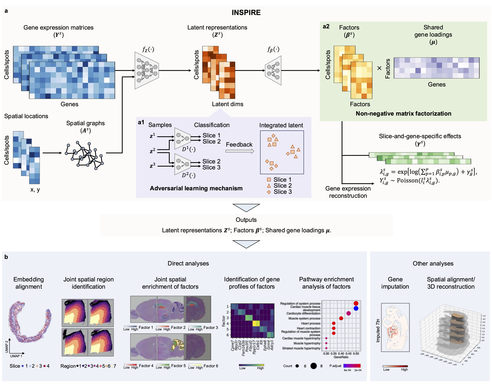

INSPIRE
=========================================================

We develop INSPIRE, a deep learning-based method for integrating and interpreting multiple spatial transcriptomics (ST) datasets from diverse sources. It integrates information across slices in a shared latent space, where meaningful biological variations from the input slices are preserved, while complex unwanted variations are eliminated. Utilizing this shared latent space, INSPIRE achieves an integrated NMF on gene expressions across slices, decomposing biological signals in different slices into consistent and interpretable spatial factors with associated gene programs. These inferred spatial factors often correspond to distinct cell populations and biological processes within the analyzed tissues.

INSPIRE takes gene expression count matrices and spatial coordinates from multiple ST slices as input, and generates three key outputs: latent representations of cells or spatial spots, non-negative spatial factors for cells or spatial spots, and non-negative gene loadings shared among datasets.

By integrating multiple ST datasets with INSPIRE, users can:
* Identify spatial trajectories and major spatial regions consistently across datasets using latent representations of cells or spatial spots.
* Reveal detailed tissue architectures, spatial distributions of cell types, and organizations of biological processes in tissues across slices using non-negative spatial factors for cells or spatial spots.
* Detect spatially variable genes, identify gene programs associated with specific spatial architectures in tissues, and conduct pathway enrichment analysis using non-negative gene loadings.

INSPIRE Tutorials
==================
.. toctree::
   :maxdepth: 3
   
   tutorials/index.rst

INSPIRE Installation
==================
.. toctree::
   :maxdepth: 2

   installation.rst
